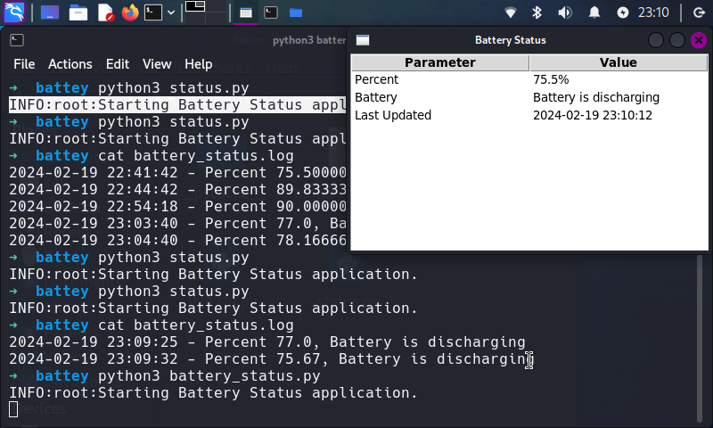

# Battery Status GUI Application

This is a simple GUI application for **Raspberry Pi** that displays the battery status. It uses the INA219 sensor to measure the battery voltage, current, power, and percentage.



## Dependencies

- Python 3
- Tkinter
- smbus
- **INA219.py** library (included in this repository)

## Installation

1. Ensure Python 3 is installed on your system. You can download it from the official [Python website](https://www.python.org/downloads/).

2. Install the smbus library using pip:

```bash
pip install smbus
```

## Usage
Run the script using Python:

- For the battery status gui application:
```bash
python3 battary_status.py
```

- For the battery status gui application and shutdown the Raspberry Pi when the battery is low gracefully.
Not recommended to run this script. It is under development and not throughly tested.
```bash
python3 battary_status_graceful_shutdown.py
```

**Note: You need to have the INA219 sensor connected to your Raspberry Pi. This code is tested with the [Waveshare UPS HAT B](https://www.waveshare.com/wiki/UPS_HAT_(B)#Document) board.**
